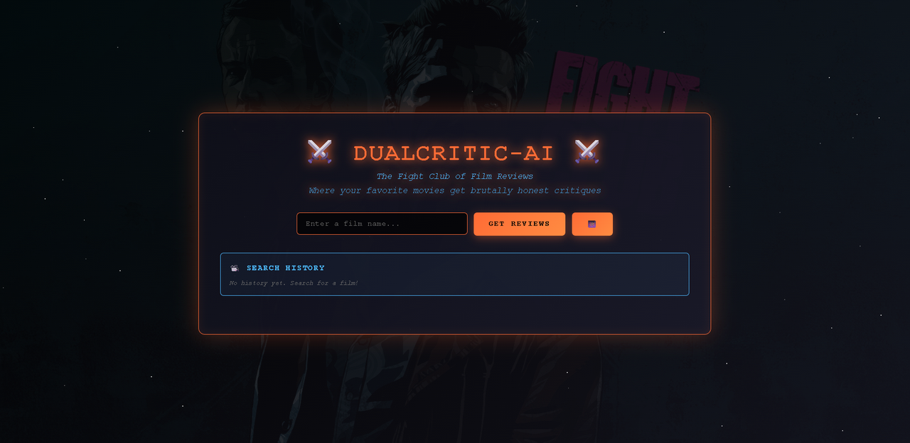
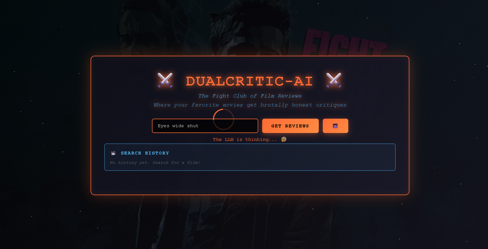
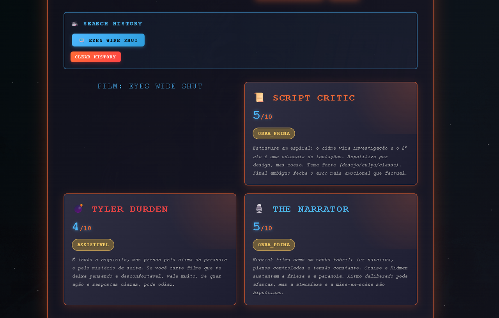

# 🎬 DualCritic-AI

> *The Fight Club of Film Reviews — onde seus filmes favoritos recebem críticas brutalmente honestas.*

**DualCritic-AI** é uma plataforma de crítica de cinema baseada em IA, construída com **Spring Boot** e **Spring AI**. A partir do *nome* de um filme, a aplicação gera **três análises independentes** — uma para a qualidade do roteiro, uma representando a crítica especializada e uma representando o público geral — e devolve um resultado estruturado, com nota, status e um resumo de cada crítico.

O projeto aplica padrões de aplicação *production-ready*: cache com **Caffeine**, observabilidade com **Actuator + Micrometer + Prometheus**, tracing distribuído com **Zipkin/Brave** e persistência via **JPA/H2**.

---

## 📑 Índice

- [Visão geral](#-visão-geral)
- [Demonstração](#-demonstração)
- [Como funciona](#-como-funciona)
- [Os três críticos](#-os-três-críticos)
- [Tecnologias](#-tecnologias)
- [Arquitetura do projeto](#-arquitetura-do-projeto)
- [Pré-requisitos](#-pré-requisitos)
- [Configuração](#-configuração)
- [Como executar](#-como-executar)
- [Endpoints da API](#-endpoints-da-api)
- [Exemplo de resposta](#-exemplo-de-resposta)
- [Observabilidade](#-observabilidade)
- [Banco de dados](#-banco-de-dados)
- [Roadmap](#-roadmap)
- [Licença](#-licença)

---

## 🔭 Visão geral

A ideia central é simples: você informa o nome de um filme e recebe de volta a "discussão" de três críticos com personalidades distintas. O nome **Fight Club** é uma referência temática — os críticos são *Tyler Durden* e *The Narrator*, somados a um terceiro crítico focado puramente em estrutura de roteiro.

Cada crítica contém:

| Campo    | Descrição                                                                 |
|----------|---------------------------------------------------------------------------|
| `rating` | Nota inteira de 1 a 5.                                                    |
| `status` | Derivado da nota: `NAO_ASSISTA_PELO_AMOR_DE_DEUS`, `ASSISTIVEL` ou `OBRA_PRIMA`. |
| `about`  | Resumo textual da análise (no máximo 300 caracteres).                     |

---

## 🎥 Demonstração

### Tela inicial

A interface principal apresenta o campo de busca, o botão **Get Reviews** e um histórico de buscas.



### Buscando um filme

Ao enviar um filme, a aplicação exibe um indicador de carregamento enquanto o modelo de linguagem processa as críticas.



### Resultado

O resultado mostra os três críticos lado a lado — cada um com nota, status e seu parecer.



---

## ⚙️ Como funciona

1. O cliente faz uma requisição `GET /reviews?film=NomeDoFilme`.
2. O `FightClubController` repassa o nome para o `FightClubPromptService`.
3. O serviço monta um *prompt* com o `SYSTEM_TEMPLATE` (que define as regras e a persona de cada crítico) e chama o modelo via `ChatClient` do Spring AI.
4. A resposta da IA é convertida automaticamente para o objeto `FinalReviewResult` através do `BeanOutputConverter` (saída estruturada).
5. O resultado é persistido no banco como `FinalReviewResultEntity` e devolvido ao cliente.
6. Chamadas repetidas para o mesmo filme são servidas pelo **cache Caffeine** (`@Cacheable("filmes")`), evitando novas chamadas à API de IA.

---

## 🥊 Os três críticos

| Crítico          | Persona            | Foco da análise                                                                 |
|------------------|--------------------|----------------------------------------------------------------------------------|
| `scriptCritic`   | Analista de roteiro | Avalia **apenas** o roteiro e a estrutura narrativa com base na sinopse — estrutura de atos, arco dos personagens, ritmo e temas. Ignora a recepção. |
| `narratorCritic` | The Narrator        | Representa a **crítica especializada**. Tom analítico e acessível, focado em direção, atuação, fotografia e valor artístico. |
| `durdenCritic`   | Tyler Durden        | Representa o **público geral**. Tom informal e direto, focado em entretenimento e apelo popular — responde "valeu a pena ou não". |

> As regras de nota e a persona de cada crítico são definidas em `PromptConstants.SYSTEM_TEMPLATE`.

---

## 🛠️ Tecnologias

- **Java 21**
- **Spring Boot 4.0.6**
  - Spring Web MVC
  - Spring Data JPA
  - Spring Cache
  - Spring Boot Actuator
- **Spring AI 2.0.0-M7** — integração com modelo OpenAI (`spring-ai-starter-model-openai`)
- **H2 Database** — banco em memória + console web
- **Caffeine** — cache de alto desempenho em memória
- **Micrometer** + **Prometheus** — métricas
- **Micrometer Tracing (Brave)** + **Zipkin Reporter** — tracing distribuído
- **Lombok** — redução de boilerplate
- **Maven** (com Maven Wrapper)

---

## 🗂️ Arquitetura do projeto

```
DualCritic-AI/
├── assets/                      # Capturas de tela usadas no README
├── src/
│   ├── main/
│   │   ├── java/dualcritic/ai/
│   │   │   ├── AiApplication.java                  # Classe principal (@SpringBootApplication)
│   │   │   ├── config/
│   │   │   │   └── CacheConfig.java                # Configuração do cache Caffeine
│   │   │   ├── constants/
│   │   │   │   └── PromptConstants.java            # Template de sistema (prompt da IA)
│   │   │   ├── controller/
│   │   │   │   └── FightClubController.java        # Endpoints REST
│   │   │   ├── service/
│   │   │   │   └── FightClubPromptService.java     # Lógica de geração das críticas
│   │   │   ├── domain/
│   │   │   │   ├── FinalReviewResult.java          # Resultado agregado (3 críticas)
│   │   │   │   ├── ResultReview.java               # Crítica individual
│   │   │   │   └── enumerations/
│   │   │   │       └── MovieStatus.java            # Enum de status
│   │   │   ├── entity/
│   │   │   │   ├── FinalReviewResultEntity.java    # Entidade JPA agregada
│   │   │   │   └── ResultReviewEntity.java         # Entidade JPA individual
│   │   │   └── repository/
│   │   │       └── FinalReviewResultEntityRepository.java
│   │   └── resources/
│   │       ├── application.yaml                    # Configuração da aplicação
│   │       └── static/
│   │           └── index.html                      # Frontend
│   └── test/
│       └── java/dualcritic/ai/AiApplicationTests.java
├── pom.xml
└── mvnw / mvnw.cmd                                  # Maven Wrapper
```

---

## ✅ Pré-requisitos

- **JDK 21** ou superior
- **Maven 3.9+** (opcional — o projeto inclui o Maven Wrapper)
- Uma **chave de API da OpenAI** válida

---

## 🔧 Configuração

A aplicação lê a chave da OpenAI a partir de **variáveis de ambiente** — a chave **nunca** deve ser commitada no repositório.

Trecho relevante do `application.yaml`:

```yaml
spring:
  ai:
    openai:
      api-key: ${OPENAI_API_KEY}
      base-url: ${OPENAI_BASE_URL:https://api.openai.com/v1}
      timeout: 30s
```

### Variáveis de ambiente

| Variável          | Obrigatória | Padrão                        | Descrição                          |
|-------------------|-------------|-------------------------------|------------------------------------|
| `OPENAI_API_KEY`  | ✅ Sim       | —                             | Sua chave de API da OpenAI.         |
| `OPENAI_BASE_URL` | ❌ Não       | `https://api.openai.com/v1`   | URL base da API (útil para proxies).|

**Linux / macOS:**

```bash
export OPENAI_API_KEY="sua-chave-aqui"
```

**Windows (PowerShell):**

```powershell
$env:OPENAI_API_KEY="sua-chave-aqui"
```

---

## ▶️ Como executar

Clone o repositório:

```bash
git clone https://github.com/felipematheus1337/DualCritic-AI.git
cd DualCritic-AI
```

Defina a variável de ambiente com sua chave (veja a seção [Configuração](#-configuração)) e rode a aplicação:

```bash
# Linux / macOS
./mvnw spring-boot:run

# Windows
mvnw.cmd spring-boot:run
```

A aplicação sobe em **`http://localhost:8080`**.

Para gerar o `.jar` executável:

```bash
./mvnw clean package
java -jar target/ai-0.0.1-SNAPSHOT.jar
```

---

## 🌐 Endpoints da API

| Método | Rota       | Descrição                                          | Parâmetros                                                        |
|--------|------------|----------------------------------------------------|-------------------------------------------------------------------|
| `GET`  | `/`        | Mensagem de boas-vindas.                           | —                                                                 |
| `GET`  | `/reviews` | Gera as três críticas para um filme. Retorna `201`.| `film` *(opcional)* — nome do filme. Padrão: `Fight Club`.        |

### Exemplos

```bash
# Crítica do filme padrão (Fight Club)
curl http://localhost:8080/reviews

# Crítica de um filme específico
curl "http://localhost:8080/reviews?film=Eyes%20Wide%20Shut"
```

---

## 📦 Exemplo de resposta

```json
{
  "scriptCritic": {
    "rating": 5,
    "about": "Estrutura em espiral: o ciúme vira investigação e o 2º ato é uma odisseia de tentações. Coeso e com tema forte.",
    "status": "OBRA_PRIMA"
  },
  "durdenCritic": {
    "rating": 4,
    "about": "É lento e esquisito, mas prende pelo clima de paranoia e mistério. Se você curte filme que faz pensar, vale muito.",
    "status": "ASSISTIVEL"
  },
  "narratorCritic": {
    "rating": 5,
    "about": "Kubrick filma como um sonho febril: luz controlada e tensão constante. Ritmo deliberado, mas a atmosfera é hipnótica.",
    "status": "OBRA_PRIMA"
  }
}
```

---

## 📊 Observabilidade

O **Spring Boot Actuator** está habilitado com os seguintes endpoints expostos:

```
/actuator/health
/actuator/info
/actuator/metrics
/actuator/env
/actuator/beans
/actuator/mappings
/actuator/prometheus
```

- **Métricas Prometheus:** disponíveis em `/actuator/prometheus` via `micrometer-registry-prometheus`.
- **Tracing distribuído:** spans são exportados para o **Zipkin** via Brave (`micrometer-tracing-bridge-brave` + `zipkin-reporter-brave`).

---

## 🗄️ Banco de dados

O projeto usa **H2 em memória** para persistir os resultados gerados.

- **Console H2:** `http://localhost:8080/h2-console`
- **JDBC URL:** `jdbc:h2:mem:testdb`
- **Usuário:** `sa`
- **Senha:** *(em branco)*

> Por ser em memória, os dados são reiniciados a cada execução. O `ddl-auto` está configurado como `update`.

---

## 🧭 Roadmap

Ideias para evolução do projeto:

- [ ] Persistência durável (PostgreSQL) no lugar do H2 em memória
- [ ] Endpoint para consultar o histórico de críticas salvas
- [ ] Padrões de resiliência explícitos (retry, circuit breaker)
- [ ] Testes de integração cobrindo o fluxo completo
- [ ] Containerização com Docker / Docker Compose
- [ ] Pipeline de CI com GitHub Actions

---

## 📄 Licença

Este projeto ainda não possui uma licença definida. Considere adicionar um arquivo `LICENSE` (por exemplo, MIT) caso pretenda torná-lo open source.

---

<p align="center">
  Feito com ☕ e 🎬 por <a href="https://github.com/felipematheus1337">felipematheus1337</a>
</p>
